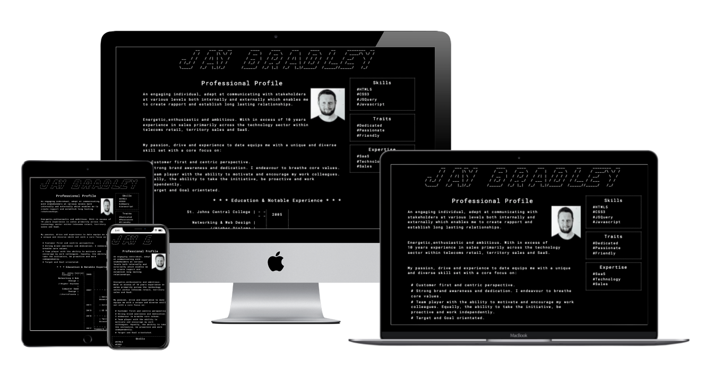
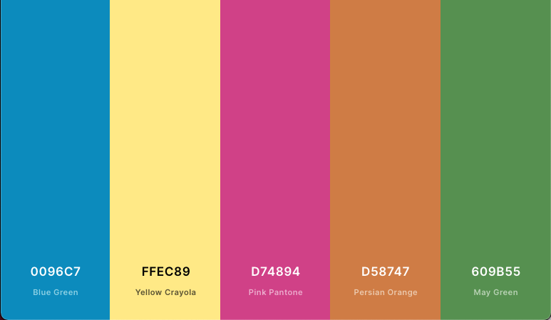
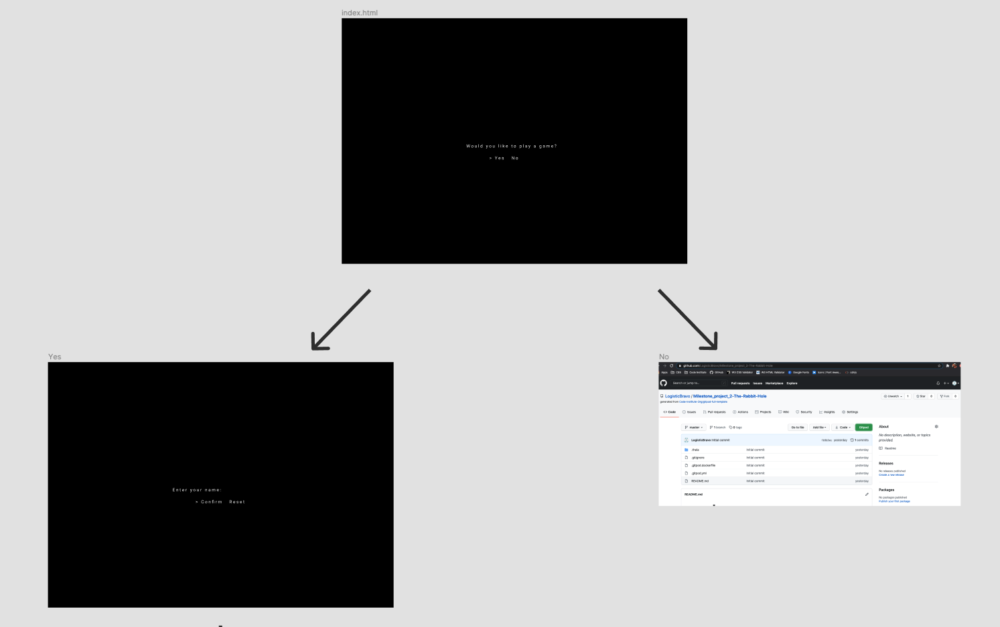
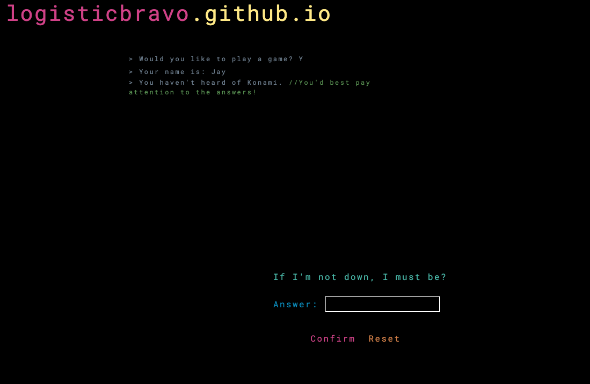
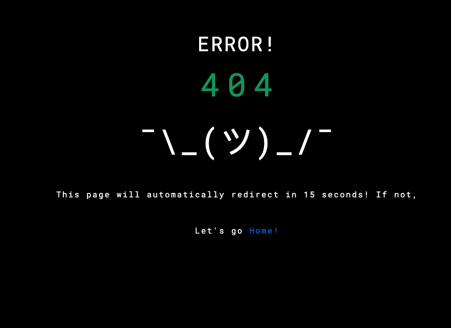
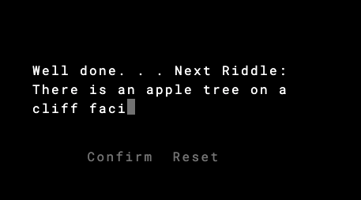
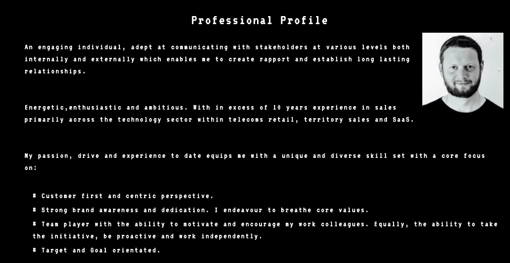
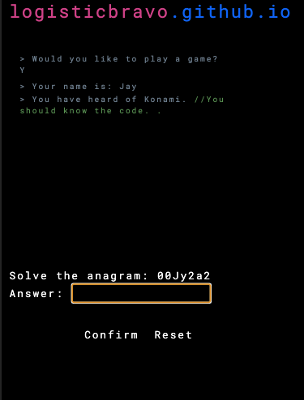
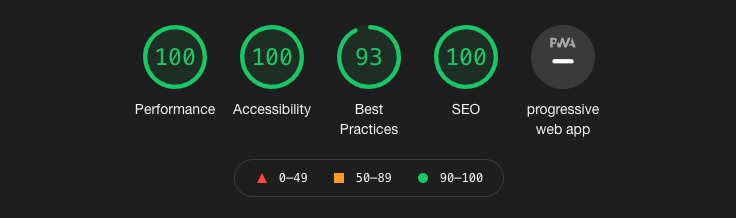

## Table of contents
---- 

- [Overview](#Milestone-Project-2 "Milestone Project 2")  
- [The Rabbit Hole](#The-Rabbit-Hole "The Rabbit Hole")  
- [User Experience](#user-experience-(ux) "User Experience")  
   - [User Stories](#user-stories "User Stories")  
        - [First Time Visitor Goals](#first-time-visitor-goals "First Time Visitor Goals")  
        - [Returning Visitor Goals](#returning-visitor-goals "Returning Visitor Goals")  
        - [Frequent User Goals](#frequent-user-goals "Frequent User Goals")  
- [Design](#design "Design")  
    - [Colour Scheme](#colour-scheme "Colour Scheme")  
    - [Typography](#typography "Typography")  
    - [Imagery](#imagery "Imagery")  
    - [Wireframes](#wireframes "Wireframes")  
- [Features](#features "Features")  
- [Technologies Used](#technologies-used "Technologies Used")  
    - [Languages Used](#languages-used "Languages Used")  
        - [HTML5](#html5 "HTML5")  
        - [CSS3](#css3 "CSS3")  
        - [Javascript & JQuery](#javascript/query "Javascript & JQuery")  
- [Frameworks, Libraries & Programs used](#frameworks-libraries-&-programs-used "Frameworks, Libraries & Programs used")  
    - [Bootstrap v.4.5.3](#bootstrap-v.4.5.3 "Bootstrap v.4.5.3") 
    - [Google Fonts](#google-fonts "Google Fonts")    
    - [Favicon](#favicon "Favicon")   
    - [Figma](#figma "Figma")  
    - [Coolors.co](#coolors.co "Coolors.co")  
    - [jQuery](#jquery "jQuery")  
    - [Git](#git "Git")  
    - [GitHub](#github "GitHub")  
    - [Gitpod](#gitpod "Gitpod")  
    - [Lighthouse](#lighthouse "Lighthouse")    
- [Testing](#testing "Testing")  
        - [Testing User Stories from User Experience (UX)](#testing-user-stories-from-user-experience-(ux) "Testing User Stories from User Experience (UX) Section")  
        - [First Time Visitor Goals](#first-time-visitor-goals "First Time Visitor Goals")  
        - [Returning Visitor Goals](#returning-visitor-goals "Returning Visitor Goals")  
        - [Frequent User Goals](#frequent-user-goals "Frequent User Goals")  
    - [Further Testing](#further-testing "Further Testing")  
    - [Known Bugs](#known-bugs "Known Bugs")  
- [Deployment](#deployment "Deployment")  
    - [Using Github Pages](#using-github-pages "Using Github Pages")  
    - [Local Clone](#local-clone "Local Clone")  
    - [Development](#development "Development")  
    - [Bugs & Feature Requests](#bugs-&-feature-requests "Bugs & Feature Requests")  
- [Credits](#credits "Credits")  
    - [Code](#code "Code")  
    - [Content](#content "Content")  
    - [Media](#media "Media")  
    - [Acknowledgements](#acknowledgements "Acknowledgements")  
# Milestone Project 2
        
    

This was created to demonstrate learnings from the Code Institute software development course and marks the second of four milestone projects to be created. It is to showcase HTML, CSS,Javascript and UX by way of an interactive front end website.

## The Rabbit Hole

The Rabbit Hole website is a fully responsive website designed to primarily showcase the site owners knowledge and understanding of HTML, CSS and Javascript. It was inspired by old school gaming centered around the 'hacker' theme and the concept of 'Easter Eggs' as well as CLI.
It's core 'Easter Egg' is the key listener for the 'Konami Code' and the sites layout is inspired by games such as Uplink and hacknet. The site is deliberatley designed to be ominous and intriguing by replicating the "Follow the white rabbit" scene from The Matrix. 
The 'Konami code' is infamously known as &#8593; &#8593; &#8595; &#8595; &#8592; &#8594; &#8592; &#8594; B A.   
For those unfamiliar with the Konami Code, the site guides you through a series of riddles of which the answer to each riddles corresponds to a value of the Konami code.   
As such, the answers to the riddles, in order are: **up, up, down, down, left, right, left, right, b, a**.   

For the site owner, it’s purpose is to provide a fun, unique and interactive way of displaying his CV.  

A live version of the site can be viewed [here](https://logisticbravo.github.io/Milestone_project_2-The-Rabbit-Hole).

## User Experience (UX)
### User stories
#### First Time Visitor Goals
* As a First Time Visitor, I want to have an interactive fun experience.
* As a First Time Visitor, I want to receive feedback on my progression. 
* As a First Time Visitor, I want to be redirected to the landing page if I navigate to a wrong or broken link.
#### Returning Visitor Goals
* As a Returning Visitor, I want to be able to easily navigate throughout the site to find content.
* As a Returning Visitor, I want to discover any and all easter eggs.
#### Frequent User Goals
* As a Frequent User, I want to access the site across a range of devices.
* As a Frequent user, I want to see if any additional content or features have been added. 

### Design
#### Colour Scheme
The site uses the following 6 colours primarily.   

* Blue - rgb(0,150,199) #0096C7
* Yellow - rgb(255,236,137) #FFEC89
* Pink - rgb(215,72,148) #D74894
* Orange - rgb(213,135,71) #D58747
* Green - rgb(96,155,85) #609B55
* Cyan - rgb(77,189,174) #4DBDAE
* White - rgb(255,255,255) #FFFFFF

In places it uses an alternate Green - rgb(3,160,98) #03A062
#### Typography
* [The Roboto font](https://fonts.google.com/specimen/Roboto) is used on all elements throughout the site with monospace as a fall back in case of errors in loading the font. Roboto is a clean and stylish popular choice as Androids default font and so fits the target market of those that are more ‘tech’ orientated and gives a modern CLI esque take on the font. 
* [VT323](https://fonts.google.com/specimen/VT323) is used as an additional theme choice on the CV page and is a fitting nod to many an old school game. 
#### Imagery
The site uses only one image which is that of the site owner and can be found on the CV page.   
If so inclined, the ASCII formatted name of the  site owner on the CV page could also be classified as an image. 
#### Wireframes
   

Full Wireframes drawn up using Figma can be found [here](https://www.figma.com/file/mL9JotMF4MYMdmlnQvNUHA/Milestone-Project-2-The-Rabbit-Hole?node-id=0%3A1)

## Features
* The index page features a flashing cursor animation.
* The site uses a Typewritter effect function to type everything to the screen.
* The site uses a rolladex animation on the ASCII numbers before loading the CV page which when locked in turn green.
* The CV page offers 3 themes.   
* The site has a key listener in place so as to capture and implement an effect from the correct key strokes being input.
* The site has a number of "Easter Eggs" throughout.    
   
    
* The site provides feedback on the users progress by way of a CLI type effect. 
* Custom 404 page should the user navigate to a non-existant link which will automatically be redirected to home.   
This can be tested [here](https://logisticbravo.github.io/Milestone_project_2-The-Rabbit-Hole/404.html)    
    

## Technologies Used
### Languages Used
#### [HTML5](https://www.w3schools.com/html/default.asp)
* Html5 and semantic markup is used for the creation of this website.
#### [CSS3](https://www.w3schools.com/css/default.asp)
* CSS is used for styling various elements throughout the site. 
#### [Javascript/JQuery](https://www.w3schools.com/js/default.asp)
* javascript and Jquery is the primary language used for development of the website. 

### Frameworks, Libraries & Programs Used
#### [Bootstrap v.4.5.3](https://getbootstrap.com/) 
* Bootstrap was used throughout the project for it’s responsiveness of the website and styling such as paddings and margins. 
#### [Google Fonts](https://fonts.google.com/)  
* Google fonts were used for the importing of the ‘Roboto’ and ’VT323’ fonts to the style.css page which is used throughout the entirety of the site.
#### [Favicon]()  
* favIcon was used to create the site favicon.
#### [Figma](https://figma.com/)
* Figma was used to create more wirframing.
#### [Coolors.co](https://coolors.co/)
* Coloors was used to assist with choosing the colour scheme that is used throughout the website.
#### [jQuery](https://www.w3schools.com/jquery/default.asp)
* jQuery was used extensively in the script files.
#### [Git](https://git-scm.com/)
* Git was used for version control by utilizing the Gitpod terminal to commit to Git and Push to GitHub.
#### [GitHub](https://github.com/)
* GitHub is used to store the projects code after being pushed from Git.
#### [Gitpod](https://gitpod.io/)
* Gitpod was used as the primary IDE for development of the site.    
#### [Lighthouse](https://developers.google.com/web/tools/lighthouse)
* Lighthouse, a Google Web Dev tool, was used extensively for testing performance, accessability, best practices and SEO of the site in it's entirety.

## Testing
The W3C Markup Validator and W3C CSS Validator Services were used to validate every page of the project to ensure there were no syntax errors in the project.

All links have been extensively tested to ensure correct continuity.

### Testing User Stories from User Experience (UX)
#### First Time Visitor Goals
* The site features an engaging and intriguing command line interface typewrtier function which encourages the user to play along.   
* The site alerts the user when they have entered a correct guess either via an alert box or by allowing them to proceed. It aslo prints their previous command to the screen. Additionaly it provides a hint with regard to the format of the users answer.
* The site has a fun 404 page.    

#### Returning Visitor Goals
* The site has a fairly linear structure that guides and prompts the user through each section. All links via functions were also extensively tested to ensure continuity. 
* The site features a number of Easter eggs. Notably the ability to change themes upon their discovery.   

#### Frequent User Goals
* The site is adequately responsive across Desktops, tablets and mobile devices and was tested using Chrome Developer tools on Ipad, Ipad Pro, Iphone 6,7,8 X, Xiaomi F2, Xiamoi F1, Mac pro, MacBook and Safari.   
* When time allows, the CV page will be updated with a contact modal.    

#### Further Testing
Lighthouse, a Google Chrome web developement tool, was used extensively on the site in it's entirety. Every individual page was tested for desktop and mobile and received a score of in excess of 80+ across Performance, Accessability, Best Practices and SEO.    
    
A copy of the Lighthouse report for each individual page can be found below:    
* Index - [Lighthouse Desktop Result](mdassets/pdf/index-lighthouse-report-desktop.pdf) | [Lighthouse Mobile Result](mdassets/pdf/index-lighthouse-report-mobile.pdf)
* CV - [Lighthouse Desktop Result](mdassets/pdf/cv-lighthouse-report-desktop.pdf) | [Lighthouse Mobile Result](mdassets/pdf/cv-lighthouse-report-mobile.pdf)
* 404 - [Lighthouse Desktop Result](mdassets/pdf/404-lighthouse-report-desktop.pdf) | [Lighthouse Mobile Result](mdassets/pdf/404-lighthouse-report-mobile.pdf)
#### Known Bugs
* The pixel icon dissappears on one occasion when typing out solve.

## Deployment

#### Using Github Pages
  
1. Navigate to the GitHub Repository:[The Rabbit Hole](https://github.com/LogisticBravo/Milestone_project_2-The-Rabbit-Hole)
2. Click the 'Settings' Tab.
3. Scroll Down to the Git Hub Pages Heading.
4. Select 'Master Branch' as the source.
5. Click the Save button.
6. Click on the link to go to the live deployed page.

#### Local Clone
1. Navigate to the GitHub Repository: [The Rabbit Hole](https://github.com/LogisticBravo/Milestone_project_2-The-Rabbit-Hole)
2. Click the Code drop down menu.
3. Either Download the ZIP file, unpackage locally and open with IDE (This route ends here) OR Copy Git URL from the dialogue box.
4. Open your developement editor of choice and open a terminal window in a directory of your choice.
5. Use the 'git clone' command in terminal followed by the copied git URL.
6. A clone of the project will be created locally on your machine.

### Development
We welcome all contributions. To do so:

1. Fork the Repo.
2. Log in to GitHub and locate the [Respository](https://github.com/LogisticBravo/Milestone_project_2-The-Rabbit-Hole).
3. At the top of the Repository (not top of page) just above the "Settings" Button on the menu, locate the "Fork" Button.
4. You should now have a copy of the original repository in your GitHub account.	
5. Create a new branch.
6. Make your changes and ensure adequate testing with supporting documents.
7. Adhere accordingly to the existing style. 
8. Commit often with clear commit messages.
9. Push to the branch.
10. Create a pull request.

### Bugs & Feature Requests

Should you find a bug and want to help us squash it. Please open an issue [here](https://github.com/LogisticBravo/Milestone_project_2-The-Rabbit-Hole/issues/new) ensuring you add the '**bug**' label  with clear detail under the following:
* What you done?
* Where you done it?
* What you expected to happen?
* What actually happened?
	
To request a new feature or function then please open an issue [here](https://github.com/LogisticBravo/Milestone_project_2-The-Rabbit-Hole/issues/new) ensuring you add the '**enhancement**' label  with proposed changes including snippets of how to do so.

## Credits

### Code
* Bootstrap4: Bootstrap Library used throughout the project mainly to make site responsive using the Bootstrap Grid System.
* CSS Styling code and corresponding classes/id’s was that of the developer Jay Bradley.
* Majority of all Javascript written was that of the developer Jay Bradley. Those that were not are attributed below and within the code. 

### Content
* The structure and concept were entirely that of the the developer Jay Bradley. Some riddles were found via a google search. 
* The CV is a true CV of the developer, Jay Bradley.

### Media
* The image is that of the developer, Jay Bradley.  
* ASCII imagery such as that found on the CV and 404 page were typed by the developer, Jay Bradley.

### Acknowledgements
* My wife for her continued support as I worked through this.
* My Mentor, Seun for her great feedback and continously pushing me.
* Konami for creating great games and the original Konami Code. 
* [CSS Tricks](https://css-tricks.com/animating-number-counters/) article which formed the animation function for the rolladex of numbers. 
* [Mastering JS](https://masteringjs.io/tutorials/fundamentals/compare-arrays) article for the function to compare arrays.
* [Javascript.info](https://javascript.info/task/shuffle) Fischer-Yates algorythm which shuffles the array.
* [W3 Schools](https://www.w3schools.com/howto/howto_js_typewriter.asp) for the baseline for the typeWriter Effect. 
